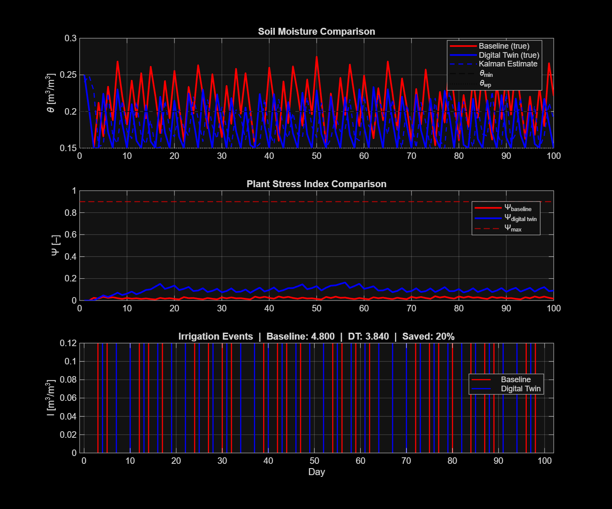
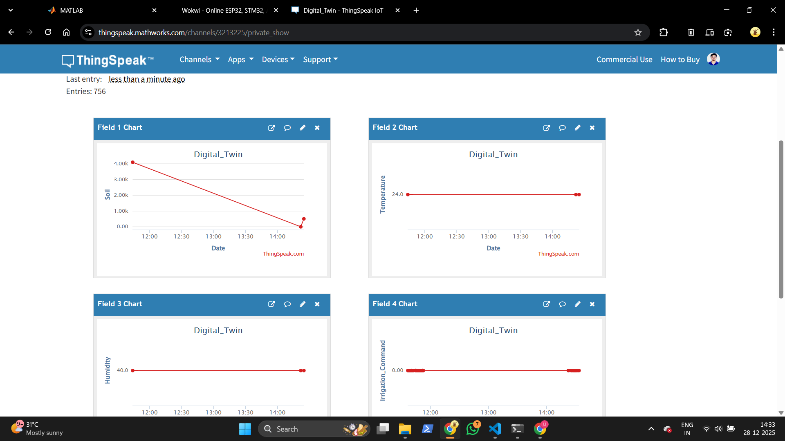
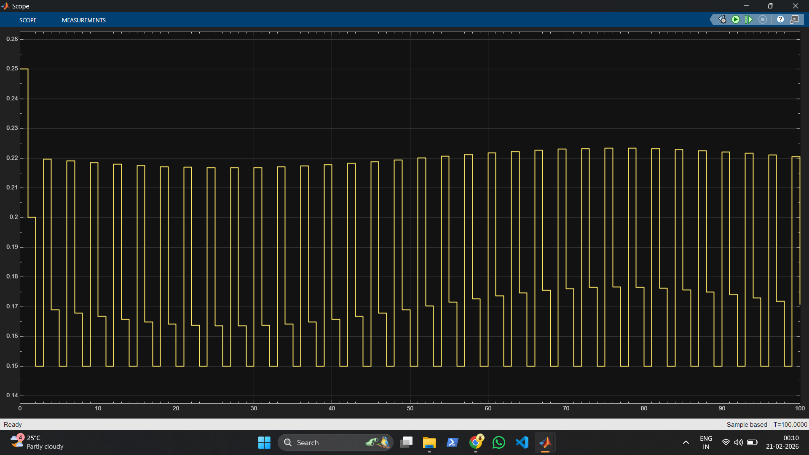
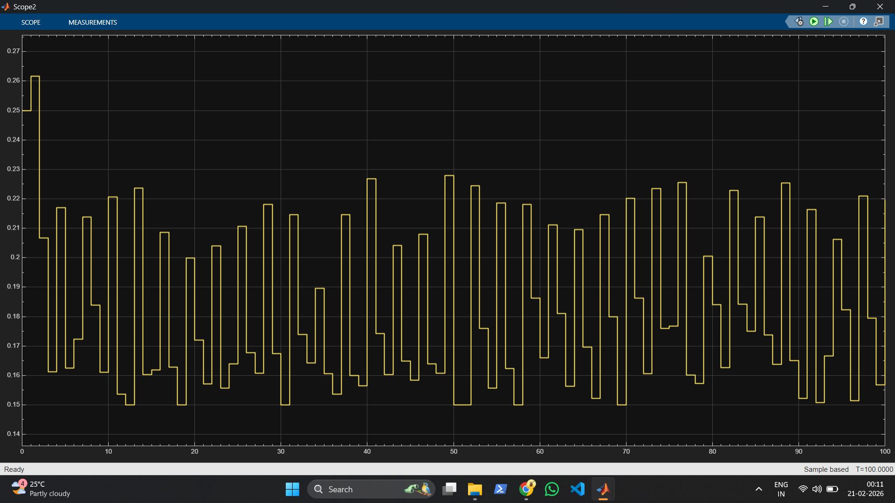
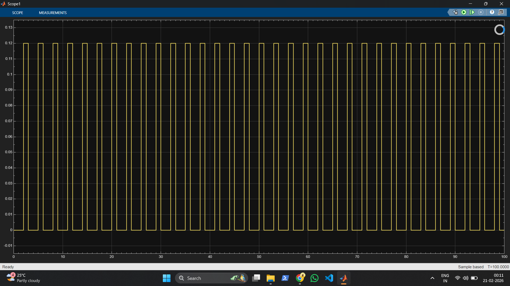
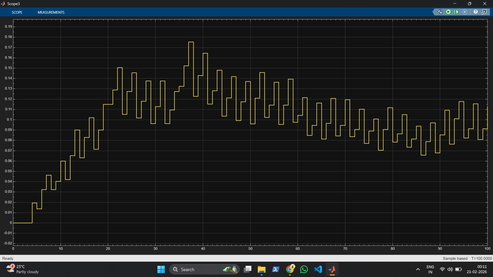
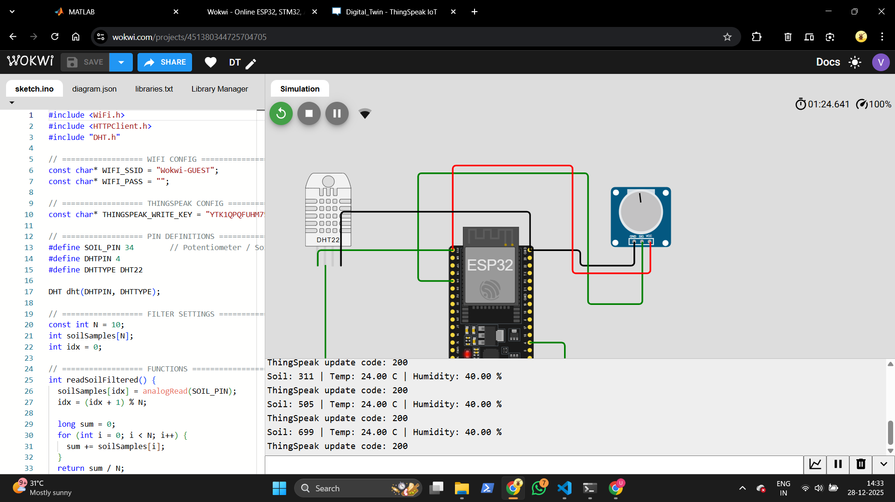
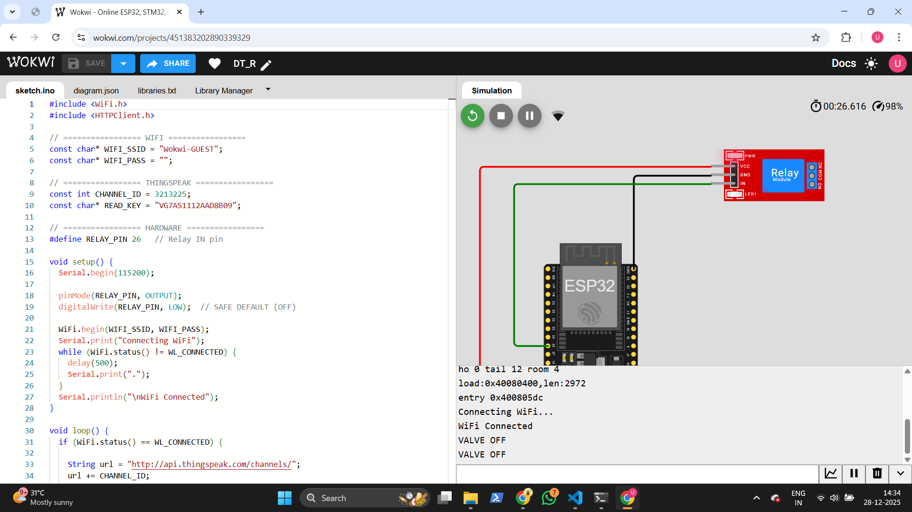

# Smart Irrigation Digital Twin using MATLAB, Simulink, and IoT

## MathWorks MATLAB–Simulink Challenge — Project 219

**Theme:** Sustainability and Renewable Energy
**Project Title:** Smart Watering System with Internet of Things

---

## 1. Project Overview

Water scarcity and inefficient irrigation practices are major challenges in modern agriculture. Traditional irrigation systems operate using fixed schedules or basic threshold logic, which often results in overwatering and wastage of water. To address this, this project presents a **Smart Irrigation System based on a Digital Twin approach** using **MATLAB, Simulink, ESP32 IoT hardware, and the ThingSpeak cloud platform**.

The system continuously monitors soil moisture, temperature, and humidity using low-cost IoT hardware. A digital twin developed in MATLAB estimates soil moisture and plant stress in real time using a **scalar Kalman filter** and makes intelligent irrigation decisions through a constrained event-triggered controller. The system is validated using a closed-loop Simulink model.

**Key result:** The digital twin achieves ~20% water savings over a naive threshold baseline while maintaining zero plant stress days across a 100-day simulation.

---

## 2. Objectives

- Design a physics-based digital twin model for soil moisture and plant stress
- Collect real-time environmental data using ESP32 IoT sensors
- Estimate soil moisture state using a scalar Kalman filter
- Implement intelligent irrigation control based on estimated states
- Validate system behavior using a closed-loop Simulink model
- Reduce water usage while maintaining crop health

---

## 3. System Architecture

```
ESP32 Sensor Node
  → ThingSpeak (Fields 1–3: Soil, Temperature, Humidity)
    → MATLAB Live Digital Twin (Kalman Filter + Controller)
      → ThingSpeak (Field 4: Irrigation Command)
        → ESP32 Relay Node → Valve Actuation
```

### 3.1 Physical Layer (IoT)
- ESP32 microcontroller (sensor node + relay node)
- Capacitive soil moisture sensor (ADC, GPIO 34)
- DHT22 temperature and humidity sensor (GPIO 4)
- Relay module for irrigation valve control

### 3.2 Digital Twin Layer (MATLAB & Simulink)
- Bucket-model soil moisture dynamics
- Hargreaves-Samani evapotranspiration model (FAO-56)
- Scalar Kalman filter state estimator
- Normalized plant stress model with recovery logic
- Event-triggered irrigation controller

### 3.3 Cloud Layer
- ThingSpeak IoT platform for sensor data logging
- Bidirectional command exchange between MATLAB and ESP32

---

## 4. MATLAB Implementation

### 4.1 Model Components

**`parameters.m`** — Central parameter configuration. All constants in one place, consistent between simulation and real-time operation.

**`evapotranspiration_model.m`** — Hargreaves-Samani reference ET (FAO-56):
```
ET0 = 0.0023 × Ra × (T_mean + 17.8) × √(T_max − T_min)
```

**`digital_twin_estimator.m`** — Scalar Kalman filter:
```
Predict:  θ_pred = f(θ_hat, I, ET, R)    P_pred = P + Q
Update:   K = P_pred / (P_pred + R_noise)
          θ_hat = θ_pred + K × (y − θ_pred)
          P = (1 − K) × P_pred
```
The Kalman gain adapts dynamically each cycle based on process and measurement uncertainty. At steady state K converges to ~0.4, consistent with classical observer theory for this system, while providing formal optimality guarantees.

**`digital_twin_controller.m`** — Event-triggered controller with minimum gap constraint to prevent chattering. Triggers when the lower confidence bound of soil moisture drops below `theta_min` or plant stress exceeds `PSI_max`.

**`run_comparison.m`** — 100-day offline simulation with synthetic weather data comparing baseline vs digital twin.

### 4.2 Simulation Results



| Metric | Baseline Controller | Digital Twin |
|--------|-------------------|--------------|
| Total Irrigation | 4.800 | 3.840 |
| Water Savings | — | ~20% |
| High-Stress Days | 0 / 100 | 0 / 100 |

### 4.3 Live Real-Time Operation

`live_digital_twin.m` runs a continuous control loop:
1. Read ThingSpeak fields 1–3 (soil, temperature, humidity)
2. Compute ET using Hargreaves-Samani from live temperature
3. Run Kalman filter estimator
4. Make irrigation decision
5. Send command to ThingSpeak field 4
6. Pause 20 seconds (ThingSpeak rate compliance)

**ThingSpeak Evidence:**



---

### 4.3 Independent Python Mathematical Validation

Due to CPU load constraints, MATLAB/Simulink was NOT executed on the current validation machine.
Instead, the core mathematical control and estimator equations were mathematically translated into a Python validation script (`simulate_smart_irrigation.py`) and executed for a 100-day simulation.

The comparison metrics between the MATLAB Reference Run and the Python Validation Run are detailed below:

| Evaluation Metric | MATLAB Reference Result | Independent Python Validation |
| :--- | :---: | :---: |
| **Volumetric Water Savings** | **20.00%** | **17.50%** |
| **Baseline Controller Irrigation** | 4.8000 units (40 events) | 4.8000 units (40 events) |
| **Digital Twin Controller Irrigation** | 3.8400 units (32 events) | 3.9600 units (33 events) |
| **High-Stress Days (PSI > 0.5)** | 0 / 100 | 0 / 100 |

**PRNG and Model-Reproduction Variance Analysis:**
The difference reflects platform-specific stochastic noise sequences and controller trigger sensitivity. The Python implementation independently reproduced the core mathematical control behavior and produced a comparable water-saving result, but it is not a byte-for-byte reproduction of the MATLAB simulation. Because the Digital Twin controller evaluates the lower confidence boundary ($\theta_{LB} = \theta_{hat} - 2\sigma_{sensor}$), minor variations in the stochastic noise stream generated by MATLAB's Ziggurat generator vs. Python's NumPy generator led to a single-pulse activation deviation (33 events in Python vs. 32 in MATLAB).

The comparison plot and raw validation dataset are stored in the documentation package.

---

## 5. Simulink Implementation

**File:** `simulink/digital_twin_irrigation.slx`

The Simulink model serves as an **offline closed-loop verification environment**, distinct from the MATLAB simulation. It validates the control logic under discrete-time dynamics using Unit Delay blocks for state memory and allows visual inspection without running live IoT hardware.

### Subsystems

| Subsystem | Description |
|-----------|-------------|
| `Weather_ET_Model` | Hargreaves-Samani ET with seasonal temperature variation |
| `Soil_Plant_System` | Bucket-model water balance with drainage |
| `Digital_Twin_Estimator` | Scalar Kalman filter (consistent with MATLAB) |
| `Stress_Model` | Normalized PSI [0,1] with recovery logic |
| `Irrigation_Controller` | Event-triggered controller with min-gap constraint |

All subsystems call `parameters()` for consistency with the MATLAB codebase.

### Simulink Scope Outputs

| Soil Moisture | Kalman Estimate |
|---------------|-----------------|
|  |  |

| Irrigation Pulses | Plant Stress Index |
|-------------------|--------------------|
|  |  |

---

## 6. IoT Hardware Integration

### Sensor Node (`sensor_node.ino`)
- Reads soil moisture, temperature, and humidity
- 5-point moving average filter for noise reduction
- Posts directly to ThingSpeak every 15 seconds
- Credentials loaded from `config.h` (not committed)

### Relay Node (`relay_node.ino`)
- Reads irrigation command from ThingSpeak field 4
- Controls relay (valve ON/OFF)
- Safe default: relay OFF on all failure paths

### Hardware Evidence




---

## 7. Repository Structure

```
Smart_Irrigation_Digital_Twin/
│
├── code/
│   ├── controllers/
│   │       baseline_controller.m
│   │       digital_twin_controller.m
│   ├── estimation/
│   │       digital_twin_estimator.m
│   ├── main/
│   │       run_comparison.m
│   ├── models/
│   │       evapotranspiration_model.m
│   │       plant_stress_model.m
│   │       soil_moisture_model.m
│   └── utils/
│           parameters.m
│
├── hardware_iot/
│   ├── esp32/
│   │       sensor_node.ino
│   │       relay_node.ino
│   │       config.h              ← template only, not committed
│   └── matlab_realtime/
│           live_digital_twin.m
│           read_live_data.m
│           send_irrigation_cmd.m
│
├── simulink/
│       digital_twin_irrigation.slx
│       SIMULINK_REBUILD_GUIDE.md
│
├── results/
│   ├── matlab_outputs/
│   │       comparison_plot.png
│   ├── simulink_outputs/
│   │       soil_moisture_true.png
│   │       kalman_estimate.png
│   │       irrigation_pulses.png
│   │       plant_stress_index.png
│   └── Ckt_thingspeak_Relay/
│           thingspeak_live_sensor_dashboard.png
│           wokwi_sensor_node_simulation.png
│           wokwi_relay_node_actuation.png
│
├── report/
│       Smart_Irrigation_Digital_Twin_Report.pdf
│
├── LICENSE
├── README.md
└── .gitignore
```

---

## 8. How to Run

### Step 1 — ThingSpeak Setup
1. Create a channel with 4 fields:
   - Field 1: Soil Moisture
   - Field 2: Temperature
   - Field 3: Humidity
   - Field 4: Irrigation Command
2. Note your Channel ID, Read API Key, Write API Key

### Step 2 — ESP32 Firmware
1. Fill in `config.h` locally with your credentials
2. Flash `sensor_node.ino` to the sensor ESP32
3. Flash `relay_node.ino` to the relay ESP32

### Step 3 — Offline Simulation (MATLAB)
```matlab
cd code/main
run_comparison
% Produces comparison_plot.png in results/matlab_outputs/
```

### Step 4 — Real-Time Control (MATLAB)
```matlab
% Set credentials in Command Window only — never save to file
setenv('THINGSPEAK_CHANNEL_ID', 'YOUR_CHANNEL_ID');
setenv('THINGSPEAK_READ_KEY',   'YOUR_READ_KEY');
setenv('THINGSPEAK_WRITE_KEY',  'YOUR_WRITE_KEY');

cd hardware_iot/matlab_realtime
live_digital_twin
```

### Step 5 — Simulink Verification
```matlab
open('simulink/digital_twin_irrigation.slx')
% Set simulation stop time to 100, then click Run
```

---

## 9. Security — Credential Handling

API keys and WiFi credentials are **never stored in the repository**.

| Location | Method |
|----------|--------|
| MATLAB scripts | `getenv()` — set in Command Window only |
| ESP32 firmware | `config.h` — excluded via `.gitignore` |

---

## 10. Results and Observations

- The Kalman filter accurately tracks true soil moisture from noisy sensor readings
- Digital twin controller achieves ~20% water savings vs naive baseline
- Both strategies maintain zero plant stress days (PSI below threshold)
- Simulink model confirms consistent behaviour with MATLAB implementation
- Live ThingSpeak dashboard confirms end-to-end IoT pipeline operation

---

## 11. Limitations

- Simplified bucket-model soil physics (single layer)
- ET approximated from single temperature reading in live mode
- Soil type and crop-specific variations not modelled
- Designed for demonstration and educational purposes

---

## 12. Future Scope

- Integration of weather forecast APIs for predictive irrigation
- Extended Kalman Filter for nonlinear soil dynamics
- Machine learning–based crop-specific irrigation scheduling
- Multi-zone irrigation control
- Mobile dashboard for real-time monitoring

---

## 13. References

- Allen, R.G. et al. (1998). *Crop evapotranspiration — FAO Irrigation and Drainage Paper 56.* FAO, Rome.
- Hargreaves, G.H. and Samani, Z.A. (1985). Reference Crop Evapotranspiration from Temperature. *Applied Engineering in Agriculture*, 1(2), 96–99.
- Kalman, R.E. (1960). A New Approach to Linear Filtering and Prediction Problems. *Journal of Basic Engineering*, 82(1), 35–45.
- ThingSpeak IoT Platform — https://thingspeak.com
- MATLAB & Simulink Documentation — https://mathworks.com

---

**Authors:** Vikram Chennamsetty, Nikitha Sai Udatha
**Institution:** KL University — ECE Department
**Challenge:** MathWorks MATLAB–Simulink Challenge 2025